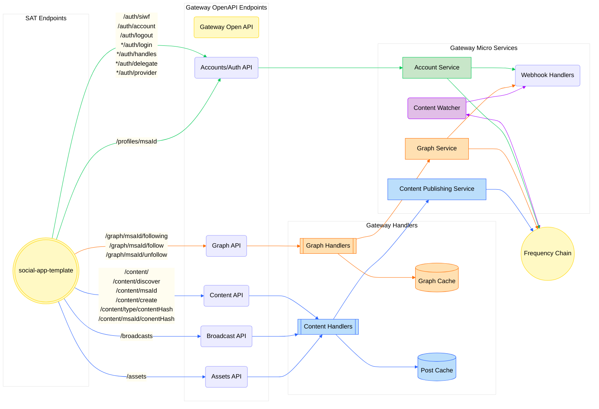

# Social App Template

The Social Application Template(SAT) is an example client app that demonstrates how to use [Gateway Services](https://github.com/AmplicaLabs/gateway).

<!-- TABLE OF CONTENTS -->

# 📗 Table of Contents

- [📖 About the Project](#about-project)
- [🔍 Arch Map](#-arch-maps)
- [🛠 Built With](#-built-with)
    - [Tech Stack](#tech-stack)
    - [Key Features](#key-features)
- [🚀 Live OpenAPI Docs](#-live-docs)
- [💻 Getting Started](#-getting-started)
    - [Prerequisites](#prerequisites)
    - [Setup](#setup)
    - [Deployment](#deployment)
- [🤝 Contributing](#-contributing)
- [⭐️ Show your support](#-support)
- [❓FAQ](#faq)
- [📝 License](#-license)

<!-- PROJECT DESCRIPTION -->

# 📖 Social Application Template (SAT) <a name="about-project"></a>

The [Gateway](https://github.com/AmplicaLabs/gateway) is a suite of services designed to make interacting with [Frequency](https://github.com/frequency-chain/frequency) easy for applications integrating with [DSNP](https://dsnp.org/).
The SAT is an example client that shows you how to use Gateway.

Gateway enables web2 companies to use a simple gateway into web3 using tooling they are accustomed to. It aims to let service providers self-serve with minimal help outside of docs and tools, rather than
interacting with Frequency directly. Providers no longer need to fully understand blockchain tooling to build on DSNP over Frequency.

<!-- Mermaid Arch maps -->

## 🔭 Arch Maps

### Overview of the Social App Template in relation to Gateway Services.

Key: * = coming soon

<p align="right">(<a href="#-table-of-contents">back to top</a>)</p>

## 🛠 Built With <a name="built-with"></a>

### Tech Stack <a name="tech-stack"></a>

<details>
  <summary>Frontend</summary>
  <ul>
    <li>Framework: <a href="https://react.dev/">React</a></li>
    <li>Language: <a href="https://www.typescriptlang.org/">Typescript</a></li>
    <li>Testing Library: 
      <ul>
        <li><a href="https://jestjs.io/">Jest</a></li>
        <li><a href="https://testing-library.com/">Testing Library</a></li>
      </ul>
    </li>
    <li>UI Library: <a href="https://ant.design/">Ant Design</a></li>
  </ul>
</details>

<details>
<summary>Backend</summary>
  <ul>
    <li>Framework: <a href="https://....">Node.js</a> with <a href="https://expressjs.com/">Express</a></li>
    <li>Language: <a href="https://www.typescriptlang.org/">Typescript</a></li>
    <li>Testing Library:<a href="https://jestjs.io/">Vitest</a></li>
    <li>API Documentation: 
      <ul>
        <li><a href="https://swagger.io/">Swagger</a></li>
        <li><a href="https://learn.openapis.org/">OpenAPI</a></li>
      </ul>
    </li>
  </ul>
</details>

<!-- Features -->

### Key Features
- **[Sign in with Frequency](https://github.com/AmplicaLabs/siwf)**
- **Create a post**
- **Create a comment on a post**
- **View a feed**
- **View other users' profiles**
- **Follow a user**

<p align="right">(<a href="#-table-of-contents">back to top</a>)</p>

<!-- LIVE Docs -->

## 🚀 Live Docs

- [Gateway Live Docs](https://amplicalabs.github.io/gateway/)
- Open Api docs coming soon...

<p align="right">(<a href="#-table-of-contents">back to top</a>)</p>

<!-- GETTING STARTED -->

## 💻 Getting Started

- ### Frontend

  See [Frontend Readme](./frontend/README.md)

- ### Backend

  See [Backend Readme](./backend/README.md)

### Prerequisites

In order to run this project you need to become a provider. To do so, visit our [Provider Dashboard](https://provider.frequency.xyz/)!

### Setup

Clone this repository to your desired folder:

Example commands:

```sh
  git clone git@github.com:AmplicaLabs/social-app-template.git
  cd social-app-template
```

### Deployment

You can deploy using our containers. Check the [docker-compose.yaml](backend/docker-compose.yaml) file for more details.

<p align="right">(<a href="#-table-of-contents">back to top</a>)</p>

<!-- CONTRIBUTING -->

## 🤝 Contributing

Contributions, issues, and feature requests are welcome!

- [Contributing Guidelines](./CONTRIBUTING.md)
- [Open Issues](https://github.com/AmplicaLabs/social-app-template/issues)

<p align="right">(<a href="#-table-of-contents">back to top</a>)</p>

<!-- SUPPORT -->

## ⭐️ Show your support


If you like this project...join the Zoom calls or loom at the label for `good-first-issue`

<p align="right">(<a href="#-table-of-contents">back to top</a>)</p>

<!-- FAQ (optional) -->

## ❓FAQ

- **Who is the Gateway built for?**
  
  - Social Media Providers. 
  
- **Who is a provider and how do you become one?**
  
  - Visit our [Provider Dashboard](https://provider.frequency.xyz/)!

- **Do I need Web 3 experience?**

    - Nope! The Gateway is an open source suite that enables Frequency integrations without web3 programming skills. The Gateway makes building/integrating a social network on the DSNP/Frequency stack as easy as a Web2 API integration.

- **Do I need to know anything about cryptocurrency?**

    - Nope! The Gateway has a coinless user interface that does not require using cryptocurrency tokens.


<p align="right">(<a href="#-table-of-contents">back to top</a>)</p>

<!-- LICENSE -->

## 📝 License

This project is [Apache 2.0](./LICENSE) licensed.

<p align="right">(<a href="#-table-of-contents">back to top</a>)</p>