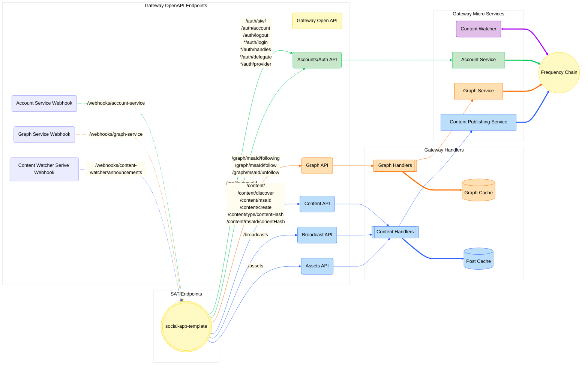

# Social App Template Backend

This is a prototype for a DSNP Gateway to allow for simple provider setup.

<!-- TABLE OF CONTENTS -->

# 📗 Table of Contents

- [📖 About the Project](#about-project)
- [🔍 Arch Map](#-arch-maps)
- [🛠 Built With](#-built-with)
  - [Tech Stack](#tech-stack)
  - [Key Features](#key-features)
- [🚀 Live OpenAPI Docs](#-live-docs)
- [💻 Getting Started](#-getting-started)
  - [Prerequisites](#prerequisites)
  - [Quick Start](#-quick-start)
  - [Setup](#setup)
    - [Clone Repo](#1-clone-this-repository-to-your-desired-folder)
    - [Environment Variables](#2-environment-variables)
    - [Install](#3-install)
    - [Setup Chain](#4-setup-chain)
    - [Start Backend](#5-start-backend)
    - [Create Provider](#6-create-provider)
    - [Generate Types](#7-generate-types)
    - [Env Init](#8-env-init)
    - [Build](#9-build)
    - [Run Tests](#10-run-tests)
    - [Deployment](#11-deployment)
- [📚 References](#-references)
- [🤝 Contributing](#-contributing)
- [❓FAQ](#faq)
- [📝 License](#-license)

<!-- PROJECT DESCRIPTION -->

# 📖 Social Application Template (SAT) <a name="about-project"></a>

The [Gateway Services](https://github.com/AmplicaLabs/gateway) are a suite of services designed to make interacting with
[Frequency](https://github.com/frequency-chain/frequency) easy for applications integrating with
[DSNP](https://dsnp.org/). The SAT is an example client that shows you how to use Gateway.

Gateway enables web2 companies to use a simple gateway into web3 using tooling they are accustomed to. It aims to let
service providers self-serve with minimal help outside of docs and tools, rather than interacting with Frequency
directly. Providers no longer need to fully understand blockchain tooling to build on DSNP over Frequency.

<!-- Mermaid Arch maps -->

## 🔭 Arch Maps

### Overview of the Social App Template in relation to Gateway Services.



<p align="right">(<a href="#-table-of-contents">back to top</a>)</p>

## 🛠 Built With <a name="built-with"></a>

### Tech Stack <a name="tech-stack"></a>

<ul>
    <li>Framework: <a href="https://....">Node.js</a> with <a href="https://expressjs.com/">Express</a></li>
    <li>Language: <a href="https://www.typescriptlang.org/">Typescript</a></li>
    <li>Testing Library:<a href="https://github.com/vitest-dev/vitest">Vitest</a></li>
    <li>API Documentation:
      <ul>
        <li><a href="https://swagger.io/">Swagger</a></li>
        <li><a href="https://learn.openapis.org/">OpenAPI</a></li>
      </ul>
    </li>
</ul>

<!-- Features -->

### Key Features

- **[Sign in with Frequency](https://github.com/AmplicaLabs/siwf)**
- **Create a post**
- **Create a comment on a post**
- **Get feed data**
- **Get users' profile data**
- **Post graph data (i.e. follow/unfollow)**
- **Get graph data (i.e.follow list)**

<p align="right">(<a href="#-table-of-contents">back to top</a>)</p>

<!-- LIVE Docs -->

## 🚀 Live Docs

- [Gateway Live Docs](https://amplicalabs.github.io/gateway/)
- Open Api docs coming soon...

<p align="right">(<a href="#-table-of-contents">back to top</a>)</p>

<!-- GETTING STARTED -->

## 💻 Getting Started

### Prerequisites

In order to run this project you need to:
-  Become a provider. To do so, visit the [Provider Dashboard](https://provider.frequency.xyz/)!
- [Get Docker](https://docs.docker.com/get-docker/)

### Setup

Clone this repository to your desired folder:

Example commands:

```sh
  git clone git@github.com:AmplicaLabs/social-app-template.git
  cd social-app-template
```

### Install

Install NPM Dependencies:

```sh
  npm install
```

### Environment Variables

The application is configured by way of environment variables. A complete list of available environment variables is
[here](./ENVIRONMENT.md). Environment variables are supplied to the application through _environment files_.

<details>
  <summary>More Details</summary>
  The default scripts and images for this app are configured in a slightly different way from the usual method. Because
  this Gateway app is a template meant to be used with other services and built upon, the supplied scripts enable
  launching a full environment of all Frequency Gateway services needed by this Gateway application. To that end, each
  service has its own environment file, as well as a "common" environment file where shared config values can be specified
  for all services without the need to duplicate entries. The environment files are named as follows; use the _[.docker]_
  variants for running the main Gateway app under docker (the other Gateway services are set up to run under Docker by
  default).

  - .env.common[.docker]
    - .env.service[.docker]
        - where < service > is one of: `account-service`, `content-publishing-service`, `content-watcher-service`,
          `graph-service`, `social-app-backend`

  Sample configuration files can be found [here](./environment/).
</details>

Initialize the env files using the templates:

```sh
npm run env:init
```

### ⚡ Quick Start (Dockerized)

This environment is the best for supporting frontend development.

To quickly start up a set of preconfigured services, including this sample backend Gateway, run:

```sh
docker compose up -d frequency
npm run local:init
docker compose --profile full up -d
```

For more details on configuring and running the individual services, see [Usage](#usage).

### ⚡ Quick Start (Bare Metal)

This environment is the best for supporting local backend development.

  ```sh
  docker compose up -d frequency
  npm run local:init
  docker compose up -d
  npm run start:dev
  ```

### Usage

#### 1. Start Frequency Node

Note: There are other options, but these are simplest to get started with.

#### Option 1: Use Public Frequency Rococo Testnet Nodes

This is best for Testnet interactions.

Setup the Environment Variables:
  - `FREQUENCY_URL="wss://rpc.paseo.frequency.xyz"`
  - `FREQUENCY_HTTP_URL="https://rpc.paseo.frequency.xyz"`

#### Option 2: Local Network from Source

This is for simple local development work.

Run the provided Docker Compose script to launch a local Frequency node:

```sh
docker compose up -d frequency
```

#### 2. Start Redis

Start Redis using Docker to manage session data and provide caching functionality. Execute the following command to initialize and run a Redis container in the background:

```sh
docker compose up -d redis
```

#### 3. Start IPFS

Start the IPFS protocol, which facilitates file storage. To start IPFS with Docker Compose, run the provided script:

```sh
docker compose up -d kubo_ipfs
```

#### 3. Create Provider

Create Provider for `//Alice` on localhost Frequency node.

Note: There are other options, but these are simplest to get started with.

- #### Option 1: Frequency Rococo Testnet

  Follow the instructions on the Frequency Provider Dashboard (coming soon).

- #### Option 2: Local Network
  ```sh
  npm run local:init
  ```

#### 4. Start Gateway Services

```sh
docker compose up -d social-app-template-services
```

#### 5. Build

**Option 1:** Build a Docker image from the Dockerfile:

```sh
npm docker-build
```

--or--

**Option 2:** Build Docker images from the docker-compose.yml file for dev:

```sh
npm docker-build:dev
```

## 📋 Testing

### Run the tests

Run the test script, which uses [Vitest](https://github.com/vitest-dev/vitest):

```sh
  npm test
```

### Linting

```sh
  npm run lint
```

### Auto-format

```sh
  npm run format
```

#### 4. Generate Types

Generate types from `openapi.json`

```sh
  npm run gen:types
```

## 📋 Debugging

1. Stop all docker containers.
    ```sh
    docker compose down
    ```
2. Go to Docker and delete all Volumes.
3. Rerun quickstart or usage commands.
4. If that doesn't work, repeat step 1 and 2, delete the relative Containers and Images, then repeat step 3.

## Deployment

You can deploy using containers. Check the [docker-compose.yaml](backend/docker-compose.yaml) file for more details.

<p align="right">(<a href="#-table-of-contents">back to top</a>)</p>

<!-- REFERENCES -->

## 📚 References

- [Frequency](https://github.com/LibertyDSNP/frequency)
- [Schemas](https://github.com/LibertyDSNP/schemas/)

<!-- CONTRIBUTING -->

## 🤝 Contributing

Contributions, issues, and feature requests are welcome!

- [Contributing Guidelines](./CONTRIBUTING.md)
- [Open Issues](https://github.com/AmplicaLabs/social-app-template/issues)

<p align="right">(<a href="#-table-of-contents">back to top</a>)</p>

<!-- LICENSE -->

## 📝 License

This project is [Apache 2.0](./LICENSE) licensed.

<p align="right">(<a href="#-table-of-contents">back to top</a>)</p>
