# Social App Template Backend

This is a prototype for a DSNP Gateway to allow for simple provider setup.

<!-- TABLE OF CONTENTS -->

# 📗 Table of Contents

- [📖 About the Project](#about-project)
- [🔍 Arch Map](#-arch-maps)
- [🛠 Built With](#-built-with)
   - [Tech Stack](#tech-stack)
   - [Key Features](#key-features)
- [🚀 Live OpenAPI Docs](#-live-docs)
- [💻 Getting Started](#-getting-started)
   - [Prerequisites](#prerequisites)
   - [Quick Start](#-quick-start)
   - [Setup](#setup)
     - [Clone Repo](#1-clone-this-repository-to-your-desired-folder)
     - [Environment Variables](#2-environment-variables)
     - [Install](#3-install)
     - [Setup Chain](#4-setup-chain)
     - [Start Backend](#5-start-backend)
     - [Create Provider](#6-create-provider)
     - [Generate Types](#7-generate-types)
     - [Env Init](#8-env-init)
     - [Build](#9-build)
     - [Run Tests](#10-run-tests)
     - [Deployment](#11-deployment)
- [📚 References](#-references)
- [🤝 Contributing](#-contributing)
- [❓FAQ](#faq)
- [📝 License](#-license)

<!-- PROJECT DESCRIPTION -->

# 📖 Social Application Template (SAT) <a name="about-project"></a>

The [Gateway Services](https://github.com/AmplicaLabs/gateway) are a suite of services designed to make interacting with
[Frequency](https://github.com/frequency-chain/frequency) easy for applications integrating with
[DSNP](https://dsnp.org/). The SAT is an example client that shows you how to use Gateway.

Gateway enables web2 companies to use a simple gateway into web3 using tooling they are accustomed to. It aims to let
service providers self-serve with minimal help outside of docs and tools, rather than interacting with Frequency
directly. Providers no longer need to fully understand blockchain tooling to build on DSNP over Frequency.

<!-- Mermaid Arch maps -->

## 🔭 Arch Maps

### Overview of the Social App Template in relation to Gateway Services.

```mermaid
flowchart LR
    subgraph SAT["SAT Endpoints"]
        A((("social-app-template")))
    end
    subgraph Interface["Gateway OpenAPI Endpoints"]
        B("Gateway Open API")
        BA("Accounts/Auth API")
        BG("Graph API")
        BC("Content API")
        BB("Broadcast API")
        BAS("Assets API")
        ASW("Account Service Webhook")
        GSW("Graph Service Webhook")
        CWW("Content Watcher Serive Webhook")
    end
    subgraph GHCH["Gateway Handlers"]
        GH[["Graph Handlers"]]
        CH[["Content Handlers"]]
        GC[("Graph Cache")]
        PC[("Post Cache")]
    end
    subgraph GMS["Gateway Micro Services"]
        AS["Account Service"]
        GS["Graph Service"]
        CPS["Content Publishing Service"]
        CW("Content Watcher")
    end
    A -- /auth/siwf\n/auth/account\n/auth/logout\n*/auth/login\n*/auth/handles\n*/auth/delegate\n*/auth/provider --> BA
    A -- /profiles/msaId --> BA
    A -- /graph/msaId/following\n/graph/msaId/follow\n/graph/msaId/unfollow --> BG
    A -- /content/\n/content/discover\n/content/msaId\n/content/create\n/content/type/contentHash\n/content/msaId/conentHash --> BC
    A -- /broadcasts --> BB
    A -- /assets --> BAS
    ASW -. /webhooks/account-service .-> A
    GSW -. /webhooks/graph-service .-> A
    CWW -. /webhooks/content-watcher/announcements .-> A
    BG --> GH
    BA --> AS
    BC --> CH
    BB --> CH
    BAS --> CH
    GH ==> GC
    GH --> GS
    CH ==> PC
    CH --> CPS
    CW <==> FC(("Frequency Chain"))
    AS ==> FC
    GS ==> FC
    CPS ==> FC
%%{
        init: {
            'theme': 'base',
                'themeVariables': {
                'primaryColor': '#ECECFF',
                'primaryTextColor': '#000',
                'primaryBorderColor': '#9999FF',
                'lineColor': '#858585',
                'secondaryColor': '#FFFDF0',
                'tertiaryColor': '#fff'
                }
        }
    }%%
style A stroke:#FFD600,fill:#FFF9C4
style B stroke:#FFD600,fill:#FFF9C4
style BA stroke:#00C853,fill:#C8E6C9
style BG fill:#FFE0B2,stroke:#FF6D00
style BC fill:#BBDEFB,stroke:#2962FF
style BB fill:#BBDEFB,stroke:#2962FF
style BAS fill:#BBDEFB,stroke:#2962FF
style GH stroke:#FF6D00,fill:#FFE0B2
style CH stroke:#2962FF,color:#000000,fill:#BBDEFB
style GC stroke:#FF6D00,fill:#FFE0B2
style PC color:#000000,fill:#BBDEFB,stroke:#2962FF
style AS stroke:#00C853,fill:#C8E6C9
style GS fill:#FFE0B2,stroke:#FF6D00
style CPS fill:#BBDEFB,stroke:#2962FF
style CW stroke:#AA00FF,fill:#E1BEE7
style FC stroke:#FFD600,fill:#FFF9C4
linkStyle 0 stroke:#00C853,fill:none
linkStyle 1 stroke:#00C853,fill:none
linkStyle 2 stroke:#FF6D00,fill:none
linkStyle 3 stroke:#2962FF,fill:none
linkStyle 4 stroke:#2962FF,fill:none
linkStyle 5 stroke:#2962FF,fill:none
linkStyle 6 stroke:#00C853,fill:none
linkStyle 7 stroke:#FF6D00,fill:none
linkStyle 8 stroke:#2962FF,fill:none
linkStyle 9 stroke:#FF6D00,fill:none
linkStyle 10 stroke:#00C853,fill:none
linkStyle 11 stroke:#2962FF,fill:none
linkStyle 12 stroke:#2962FF,fill:none
linkStyle 13 stroke:#2962FF,fill:none
linkStyle 14 stroke:#FF6D00,fill:none
linkStyle 15 stroke:#FF6D00,fill:none
linkStyle 16 stroke:#2962FF,fill:none
linkStyle 17 stroke:#2962FF,fill:none
linkStyle 18 stroke:#AA00FF,fill:none
linkStyle 19 stroke:#00C853,fill:none
linkStyle 20 stroke:#FF6D00,fill:none
linkStyle 21 stroke:#2962FF,fill:none
```



<p align="right">(<a href="#-table-of-contents">back to top</a>)</p>

## 🛠 Built With <a name="built-with"></a>

### Tech Stack <a name="tech-stack"></a>

<ul>
    <li>Framework: <a href="https://....">Node.js</a> with <a href="https://expressjs.com/">Express</a></li>
    <li>Language: <a href="https://www.typescriptlang.org/">Typescript</a></li>
    <li>Testing Library:<a href="https://jestjs.io/">Vitest</a></li>
    <li>API Documentation: 
      <ul>
        <li><a href="https://swagger.io/">Swagger</a></li>
        <li><a href="https://learn.openapis.org/">OpenAPI</a></li>
      </ul>
    </li>
</ul>

<!-- Features -->

### Key Features

- **[Sign in with Frequency](https://github.com/AmplicaLabs/siwf)**
- **Create a post**
- **Create a comment on a post**
- **Get feed data**
- **Get users' profile data**
- **Post graph data (i.e. follow/unfollow)**
- **Get graph data (i.e.follow list)**

<p align="right">(<a href="#-table-of-contents">back to top</a>)</p>

<!-- LIVE Docs -->

## 🚀 Live Docs

- [Gateway Live Docs](https://amplicalabs.github.io/gateway/)
- Open Api docs coming soon...

<p align="right">(<a href="#-table-of-contents">back to top</a>)</p>

<!-- GETTING STARTED -->

## 💻 Getting Started

### Prerequisites

In order to run this project you need:

- [Nodejs](https://nodejs.org)

### ⚡ Quick Start

Once your env is configured, to quickly start up a set of preconfigured services, including this sample backend Gateway, simply run the following:

```sh
npm install
npm run env:init
docker compose up -d
npm run local:init
```

For more detailed instructions on configuring individual services, and running the Gateway backend locally, read on.

### ⚙️ Setup

### 1.  Clone this repository to your desired folder:

Example commands:

```sh
  git clone git@github.com:AmplicaLabs/social-app-template.git
  cd social-app-template
```

### 2. Environment Variables
    
The application is configured by way of environment variables. A complete list of available environment variables is
[here](./ENVIRONMENT.md). Environment variables are supplied to the application through _environment files_.

The default scripts and images for this app are configured in a slightly different way from the usual method. Because
this Gateway app is a template meant to be used with other services and built upon, the supplied scripts enable
launching a full environment of all Frequency Gateway services needed by this Gateway application. To that end, each
service has its own environment file, as well as a "common" environment file where shared config values can be specified
for all services without the need to duplicate entries. The environment files are named as follows; use the _[.docker]_
variants for running the main Gateway app under docker (the other Gateway services are set up to run under Docker by
default).

- .env.common[.docker]
- .env.service[.docker]
    - where < service > is one of: `account-service`, `content-publishing-service`, `content-watcher-service`, `graph-service`,
      `social-app-backend`

Sample configuration files can be found [here](./environment/)


### 3. Install
    
Install NPM Dependencies:

```sh
  npm install
```

### 4. Setup Chain
- ### IPFS Endpoint
    <details>
    <summary>Setup Info</summary>
    
    Note: There are other options, but these are the simplest to get started with.
    
    #### Option 1: Infura IPFS Service
    
    This is best for Testnet interactions.
    
    1. Setup an [Infura Account](https://app.infura.io/register)
       2. Generate an IPFS API Key
       3. Setup the Environment Variables
           - `IPFS_ENDPOINT="https://ipfs.infura.io:5001"`
           - `IPFS_BASIC_AUTH_USER="Infura Project ID"`
           - `IPFS_BASIC_AUTH_SECRET="Infura Secret Here"`
           - `IPFS_GATEWAY_URL="https://ipfs.io/ipfs/[CID]"`
    
    #### Option 2: IPFS Kubo Node
    
    This is best for local only testing, and is the default provided in the included Docker Compose script.
    
    This uses a local IPFS node with the [Kubo API](https://docs.ipfs.tech/reference/kubo/rpc/).
    
    1. Launch the Kubo IPFS container
    
    ```sh
    docker compose up -d kubo_ipfs
    ```
    
    2. Setup the Environment Variables
    
        - `IPFS_ENDPOINT="http://kubo_ipfs:5001"`
        - `IPFS_GATEWAY_URL="http://kubo_ipfs:8080/ipfs/[CID]"`
    
       Note, the `env.*.template` files are pre-configured for this setup.
    
    _Warning_: Never expose the RPC API to the public internet.
    </details>

- ### Frequency Node
    <details>
    <summary>Setup Info</summary>
    
    Note: There are other options, but these are simplest to get started with.
    
    #### Option 1: Use Public Frequency Rococo Testnet Nodes
    
    This is best for Testnet interactions.
    
    1. Setup the Environment Variables
        - `FREQUENCY_URL="wss://rpc.rococo.frequency.xyz"`
        - `FREQUENCY_HTTP_URL="https://rpc.rococo.frequency.xyz"`
    
    #### Option 2: Local Network from Source
    
    This is for simple local development work.
    
    1. Run the provided Docker Compose script to launch a local Frequency node
    
    ```
    docker compose up -d frequency
    ```
    
    2. For more realistic scenario testing, run the node in Interval Sealing mode (see comments in
       [docker-compose.yaml](./docker-compose.yaml)
       3. Setup the Environment Variables
    
           - `FREQUENCY_URL="ws://frequency:9944"`
           - `FREQUENCY_HTTP_URL="http://127.0.0.1:9944"`
    
          Note, the pre-configured `env.*.template` files are pre-configured for this scenario
    </details>

### 5. Start Backend

- #### Bare Metal

    Best for local backend development.
    
    ```sh
    npm run start:dev
    ```

- #### Dockerized
    Best for running only to support frontend development.
    
    ```sh
    docker compose up -d social-app-template-backend`
    ```


### 6. Create Provider

Create Provider for `//Alice` on localhost Frequency node.

Note: There are other options, but these are simplest to get started with.

- #### Option 1: Frequency Rococo Testnet

    Follow the instructions on the Frequency Provider Dashboard (coming soon)


- #### Option 2: Local Network

    Setup the Environment Variables\
        - `PROVIDER_ACCOUNT_SEED_PHRASE="//Alice"`\
        - `PROVIDER_ID="1"`
    
    ```sh
    npm run local:init
     ```

### 7. Generate Types

Generate types from `openapi.json`

```sh
  npm run gen:types
```

### 8. Env Init

Initialize a set of local environment files from the included environment templates:

```sh
  npm run env:init
```

### 9. Build:

Builds the TypeScript for `./dist`

See the section about [deployment](https://facebook.github.io/create-react-app/docs/deployment) for more information.

```sh
  npm run build
```

### 10. Run Tests

#### Tests:

Launches the test runner in the interactive watch mode.\
See the section about [running tests](https://facebook.github.io/create-react-app/docs/running-tests) for more information.

```sh
  npm test
```

#### Linting:

```sh
  npm run lint
```

#### Auto-format:

```sh
  npm run format
```

### 11. Deployment

You can deploy using containers. Check the [docker-compose.yaml](backend/docker-compose.yaml) file for more details.

<p align="right">(<a href="#-table-of-contents">back to top</a>)</p>

<!-- REFERENCES -->

## 📚 References

- [Frequency](https://github.com/LibertyDSNP/frequency)
- [Schemas](https://github.com/LibertyDSNP/schemas/)


<!-- CONTRIBUTING -->

## 🤝 Contributing

Contributions, issues, and feature requests are welcome!

- [Contributing Guidelines](./CONTRIBUTING.md)
- [Open Issues](https://github.com/AmplicaLabs/social-app-template/issues)

<p align="right">(<a href="#-table-of-contents">back to top</a>)</p>

<!-- LICENSE -->

## 📝 License

This project is [Apache 2.0](./LICENSE) licensed.

<p align="right">(<a href="#-table-of-contents">back to top</a>)</p>
