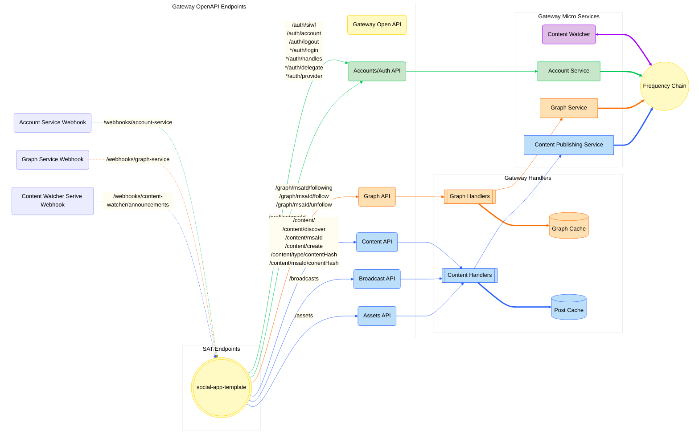

# Social App Template Frontend

<!-- TABLE OF CONTENTS -->

# 📗 Table of Contents

- [📖 About the Project](#about-project)
- [🔍 Arch Map](#-arch-maps)
- [🛠 Built With](#-built-with)
  - [Tech Stack](#tech-stack)
  - [Key Features](#key-features)
- [🚀 Live OpenAPI Docs](#-live-docs)
- [💻 Getting Started](#-getting-started)
  - [Prerequisites](#prerequisites)
  - [Setup](#setup)
  - [Environment Variables](#environment-variables)
  - [Install](#install)
  - [Usage](#usage)
  - [Run tests](#run-tests)
  - [Deployment](#deployment)
- [🤝 Contributing](#-contributing)
- [❓FAQ](#faq)
- [📝 License](#-license)

<!-- PROJECT DESCRIPTION -->

# 📖 Social Application Template (SAT) <a name="about-project"></a>

The [Gateway Services](https://github.com/AmplicaLabs/gateway) are a suite of services designed to make interacting with
[Frequency](https://github.com/frequency-chain/frequency) easy for applications integrating with
[DSNP](https://dsnp.org/). The SAT is an example client that shows you how to use Gateway.

Gateway enables web2 companies to use a simple gateway into web3 using tooling they are accustomed to. It aims to let
service providers self-serve with minimal help outside of docs and tools, rather than interacting with Frequency
directly. Providers no longer need to fully understand blockchain tooling to build on DSNP over Frequency.

<!-- Mermaid Arch maps -->

## 🔭 Arch Maps

### Overview of the Social App Template in relation to Gateway Services.



<p align="right">(<a href="#-table-of-contents">back to top</a>)</p>

## 🛠 Built With <a name="built-with"></a>

### Tech Stack <a name="tech-stack"></a>

<ul>
  <li>Framework: <a href="https://react.dev/">React</a></li>
  <li>Language: <a href="https://www.typescriptlang.org/">Typescript</a></li>
  <li>Testing Library: 
    <ul>
      <li><a href="https://jestjs.io/">Jest</a></li>
      <li><a href="https://testing-library.com/">Testing Library</a></li>
    </ul>
  </li>
  <li>UI Library: <a href="https://ant.design/">Ant Design</a></li>
</ul>

<!-- Features -->

### Key Features

- **[Sign in with Frequency](https://github.com/AmplicaLabs/siwf)**
- **Create a post**
- **Create a comment on a post**
- **View a feed**
- **View other users' profiles**
- **Follow a user**

<p align="right">(<a href="#-table-of-contents">back to top</a>)</p>

<!-- LIVE Docs -->

## 🚀 Live Docs

- [Gateway Live Docs](https://amplicalabs.github.io/gateway/)
- Open Api docs coming soon...

<p align="right">(<a href="#-table-of-contents">back to top</a>)</p>

<!-- GETTING STARTED -->

## 💻 Getting Started

This project was bootstrapped with [Create React App](https://github.com/facebook/create-react-app).

To get a local copy up and running, follow these steps.

### Prerequisites

In order to run this project you need:

- [Nodejs](https://nodejs.org)

### Setup

Clone this repository to your desired folder:

Example commands:

```sh
  git clone git@github.com:AmplicaLabs/social-app-template.git
  cd social-app-template
```

### Environment Variables

The application is configured by way of environment variables. A complete list of available environment variables is
[here](./ENVIRONMENT.md). Environment variables are supplied to the application through _environment files_. The
environment is loaded by the `create-react-app` framework. Details on specific naming of environment files for different
environments (dev, test, prod, etc) can be found
[here](https://create-react-app.dev/docs/adding-custom-environment-variables/). For local development, the environment
file is `.env.local`.

A sample configuration file can be found [here](./env.template).

### Install

Install this project with:

Install NPM Dependencies:

```sh
  npm install
```

### Usage

To run the project, execute the following command:

#### Dev Mode:

Runs the app in the development mode.\
Open [http://localhost:3000](http://localhost:3000) to view it in the browser.

The page will reload if you make edits.\
You will also see any lint errors in the console.

```sh
  npm start
```

#### Build:

Builds the app for production to the `build` folder.\
It correctly bundles React in production mode and optimizes the build for the best performance.

The build is minified and the filenames include the hashes.\
Your app is ready to be deployed!

See the section about [deployment](https://facebook.github.io/create-react-app/docs/deployment) for more information.

```sh
  npm run build
```

#### Eject:

**Note: this is a one-way operation. Once you `eject`, you can’t go back!**

If you aren’t satisfied with the build tool and configuration choices, you can `eject` at any time. This command will
remove the single build dependency from your project.

Instead, it will copy all the configuration files and the transitive dependencies (webpack, Babel, ESLint, etc) right
into your project so you have full control over them. All of the commands except `eject` will still work, but they will
point to the copied scripts so you can tweak them. At this point you’re on your own.

You don’t have to ever use `eject`. The curated feature set is suitable for small and middle deployments, and you
shouldn’t feel obligated to use this feature. However we understand that this tool wouldn’t be useful if you couldn’t
customize it when you are ready for it.

```sh
  npm run eject
```

### Run tests

#### Tests:

Launches the test runner in the interactive watch mode.\
See the section about [running tests](https://facebook.github.io/create-react-app/docs/running-tests) for more information.

```sh
  npm test
```

#### Linting:

```sh
  npm run lint
```

#### Auto-format:

```sh
  npm run format
```

### Deployment

You can deploy using containers. Check the [docker-compose.yaml](backend/docker-compose.yaml) file for more details.

<p align="right">(<a href="#-table-of-contents">back to top</a>)</p>

<!-- CONTRIBUTING -->

## 🤝 Contributing

Contributions, issues, and feature requests are welcome!

- [Contributing Guidelines](./CONTRIBUTING.md)
- [Open Issues](https://github.com/AmplicaLabs/social-app-template/issues)

<p align="right">(<a href="#-table-of-contents">back to top</a>)</p>

<p align="right">(<a href="#-table-of-contents">back to top</a>)</p>

<!-- LICENSE -->

## 📝 License

This project is [Apache 2.0](./LICENSE) licensed.

<p align="right">(<a href="#-table-of-contents">back to top</a>)</p>
